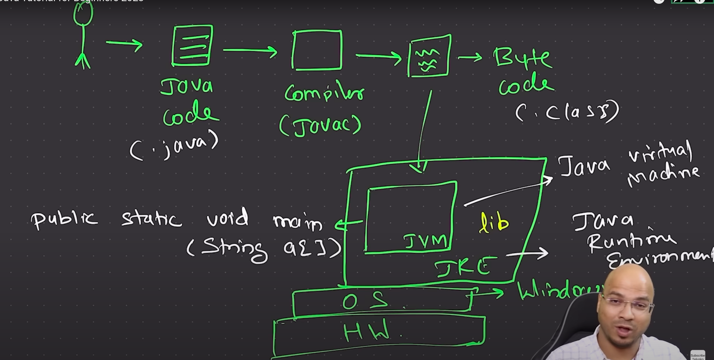
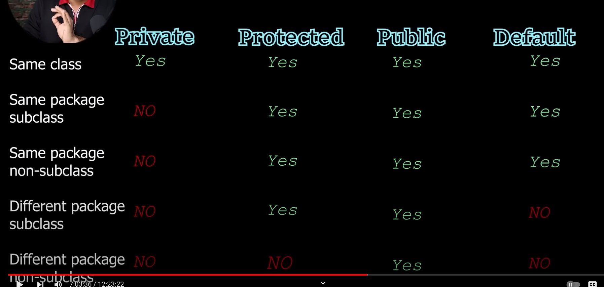
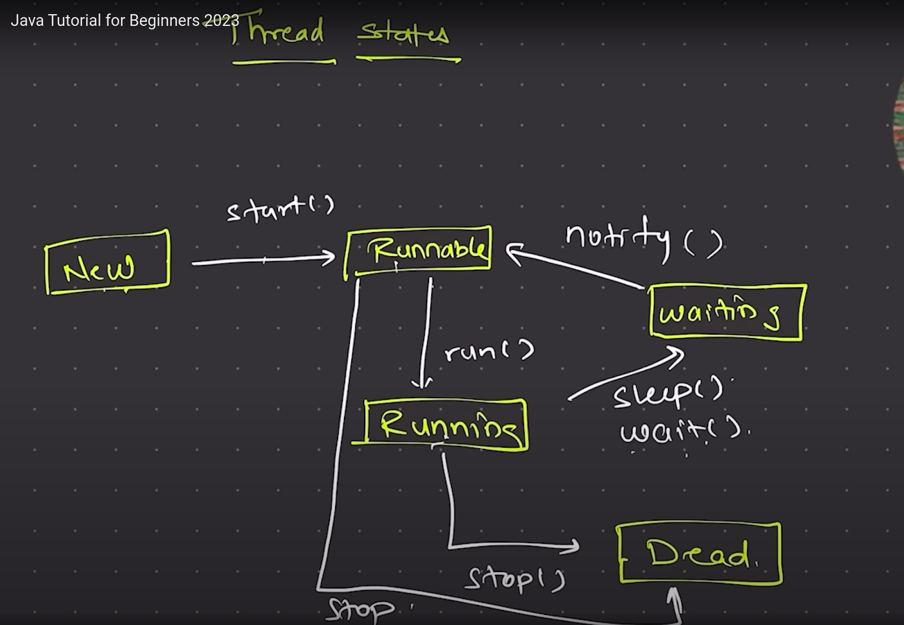

[Java Tutorial for Beginners 2023](https://www.youtube.com/watch?v=BGTx91t8q50&ab_channel=Telusko)  

# Les1 - type casting, operators, conditional statements, ternary operators, loops
Java is platform independent(WORA) because of **JVM** which is inside **JRE**.Java uses camelCases.    
JVM(Java Virtual Machine) understands only **byte code**. So **javac** is needed to compile the java code(extension => .java) to byte code(extension => .class).  
JVM will **start executing** from the **main method** present in the file which we have specified => public static void main(String a[])  
Java is object oriented and strongly typed language.  
JRE => Java Runtime Environment. JRE = JVM + other libraries    

## Primitive data types
1. integer => byte(1 bytes) short(2 bytes) int(4 bytes) long(8 bytes)
2. float =>  double, float
3. character
4. boolean  
By default double will be selected not float. So ```float amount1 = 2.3f;``` f is important else java will throw error.  
For long numbers use "l" at the last 
For char use ' and not "

## Type conversion
1. When byte is assigned to an integer variable it will be accepted but vice versa will not be accepted.
2. Explicit conversion is called as **Casting**. Eg: b = (byte)a;  
  
## Naming convention  
class and interface - Calc, Runnable  
variables and methods - marksCalculate, show()  
constants - AGE, NAME


# Les 2 Objects, Anonymous objects, Method overloading
In java objects are created using the JVM with the classes as blueprints for objects.  

JVM takes the byte code and executes. All the libraries that we have used resides in the JRE. Developers have JDK which comprises of JRE + JVM. In client machine we only need JRE + JVM no need JDK

public void func1() => Function that returns nothing
public String func1() => Function that returns string

**method overloading**
public int add(int no1, int no2)  
public int add(int no1, int no2, int no3)  
public double add(double no1, double no2)  
  
But the below examples **doesn't work**  
public int add(int no1, int no2)  
public double add(int no1, int no2)  

**Java working**  
For every method stack memory gets created.  
``` java
class Calculator{
    int result;
    public int add(int no1, int no2){
        result = no1 + no2;
        return result;
    }
}

class Les2 {
    public static void main(String a[]) {
        int no1 = 10;
        int no2 = 20;
        Calculator cal = new Calculator();
        System.out.println(cal.add(no1,no2));
    }
}
```
  

# Les 3 - Arrays


# Les 4 - Strings
String
Unlike primitive types which starts with smaller case(Eg int, float, double), String is a class so it starts with caps. 
So strings has to be created like this
```java
String name = new String("yesbee")
```
When java see code as mentioned below it automatically creates an object
```java
String name = "yesbee"
```

In heap memory there will be the **String constant pool** where all the strings will be stored.   
```java
String s1 = "sb";
String s2 = "sb";
System.out.println(s1 == s2);
//true
```
In the example mentioned above both s1 and s2 will be pointing to the same value in the String constant pool. Thats why s1 equals to s2.  

```java
String name = "yesbee";
name = "Hii " + name;
```
Initially name will be pointing to "yesbee" in the string constant pool. When name gets assigned with "Hii yesbee" a new entry is made in the string constant pool and name will be pointing to the new value. The old value will be cleared by the garbage collector.
Strings by default are immutable.  
Mutable strings can be created using **string buffer** or **string builder**  
String buffer is thread safe whereas string builder is not thread safe.  

# Les 5 - Static, constructor functions
**Static variables** are shared by all the objects. They should be **called** using their **class names**(Though they can be called using the object names avoid it) because they belong to the class and not to the object. Static variables can be used by non static methods.  
Constructor functions should have the same name as the class name and they never return anything. Constructor functions can be used for activities such as connection to DB.  
Just like method overloading, constructors can also be overloaded and a constructor with parameters is known as a parameterized constructor.  
**Constructor function**(inside a class) will be called **every time an object is created**. **Static blocks** will be **called only once** irrespective of the number of times objects are created from that class. The static blocks will be called even before the constructor. If no objects are created then then static block will not be called but we can initiate a class using the ``` Class.forName("Mobile")```(If a class is initiated then the static block will get executed)  
Just like static variables, **static methods** should be called using the class name.  
**A non static variable cannot be used inside a static method.**But the object itself can be passed to the static method and the non static variables can be accessed from the object.  

Why main method is static??  
Main function is the starting point of execution. But we cannot create an object of the class before main is executed. So we make main as static.  


# Les 6 - Encapsulation, Getters, Setters, this
Encapsulation is done using the private keyword. All instance variables(class level variables) keep them private(good practice).  
This keyword represents the current object.
```java
class Human{
    private String name;
    public void setName(String name){
        this.name = name;
    }
}
```
In the above example if name = name is used instead of this.name = name then the parameter "name" will be updated instead of the instance variable name


# Les 7 - this method, super method, inheritance
super class - parent class  
sub class - child class  
Check the code example file.  
Calculator => AdvancedCalculator - **Single level inheritance**  
Calculator => AdvancedCalculator => VeryAdvancedCalculator - **Multi level inheritance**  
In java **multiple inheritance doesn't work**. In multiple inheritance one child class inherits from two parent class.  
Every constructor has a super method in it even if we dont mention it(build in).  
The super method is used to call the constructor of the parent class(Inheritance).
If no arguments are passed then the parent(super) class's default constructor will be called if arguments are passed then the parameteriqed constructor will be called.  
**Every class** in java **extends the Object class** by default. 
The this method calls the default constructor of the same class. 

# Les 8 - Method overriding, packages
In method overriding the child class methods overwrites the parent class method.  
A group of files can be stored in a package. Keywork is "package". 
1. Create a folder
2. All the files in that folder should have  "package <folderName>;"
3. Import the file using the import keyword
   1. Eg:1 => import Les8Package.Pkg2;
   2. Eg:2 => import Les8Package.*; => import all the files(**not folder**) present in the "Les8Package" package.   
By default java.lang package will be imported in all files and System.out.println belongs to that package.  
Note: If we are going to create a package that is going to be used by others then the package name should be unique. Most of the companies make the package unique by having their domain name as the package name Eg => com.google.calculation  


# Les 9 - Access Modifiers, Polymorphism, Dynamic method dispatch, upcasting and downcasting
- public 
- private 
- protected  
  

  
Classes and methods should be public and variables should be private.  Try not using default.  

Polymorphism
- Compile time polymorphism => Method overloading
- Run time polymorphism => Method overriding, Dynamic method dispatch
  
Dynamic method dispatch - type will be parent but the object will be child. This works only for **overridden methods**.  
  
- **Final variable** => Similar to const keyword in JS.  
- **Final class** => Final classes cannot be inherited. 
- **Final method** => Final methods cannot be overridden.


# Les 10 - Abstract class and methods, Inner class, Anonymous Inner class
- Abstract methods are just declared and not defined inside the abstract classes. The child class which inherits the abstract class **should** define the abstract method. 
- If the child class is not able to define all the abstract methods then it should also be a abstract class. 
- Abstract methods should be present inside the abstract class.
- Objects cannot be created from abstract classes
- An abstract class may or may not have abstract methods.
  
**Anonymous Inner class**
Instead of creating a child class which extends the parent class just for the purpose of overriding we can use Anonymous Inner classes.

# Les 11 - Interfaces
- Interfaces are blueprints to classes and are not classes. These are very similar to abstract classes. We use interfaces when all the methods inside the abstract classes are abstract methods.
- By default all the methods inside the interfaces are **public abstract**
- Instead of extends keyword we use **implements** keyword
- By default all the variables inside the interfaces are final and static.
- A class can implement multiple interfaces. But a class can extend only one abstract class.
- An interface can **extend** (not implements) another interface. 
  - Class - Class => extends
  - Class - Interface => implements
  - Interface - Interface => extends
- Types of interfaces:
  - Normal Interface - Interface with **2 or more methods**
  - Functional Interface/SAM(Single Abstract Method) -  Interface with **only one method**
  - Marker Interface - Interface with **no methods**. This is used for serialization(storing and  data from heap memory to Harddisk/DB) and deserialization(vice versa)   

# Les 12 - Enums, Annotations
- An **enum** is a special "class" that represents a group of constants.  
- **Java Annotation** is a tag that represents the metadata i.e. attached with class, interface, methods or fields to indicate some additional information which can be used by java compiler and JVM. Annotations will not affect the code in anyways.
  - The ```@Override```  is used when we have a method in the child class which is overriding the parent class method. By mistake if the parent/child class's method name changes then @Override will throw a compile time error. Check Les8 for example.  
  - ```@FunctionalInterface```  FunctionalInterface allows only one function inside the interface. Lambda functions are based on the functional interfaces.

# Les 13 Exceptions, throws, throw
- Compile time error => Eg instead of ```System.out.println``` if we type ```System.out.print``` this will throw error during the compile time.
- Runtime error => Exceptions. Eg dividing a no by zero. 
- Logical error => Bugs   
In java we can have **multiple catch blocks**.  
Eg:
```java
try {} 
catch (ArithmeticException e) {}
catch(ArrayIndexOutOfBoundsException e){}
catch(Exception e){}
``` 
```Exception``` is the parent class for all exceptions so it has to be at the last.  
**throws** allows the method in the child class to throw error which is handled in the parent class.  
**e.printStackTrace()** prints the entire stack trace. 
```
ArithmeticException catch block java.lang.ArithmeticException: / by zero
java.lang.ArithmeticException: / by zero
	at Divide.calculate(Les13.java:10)
	at Les13.main(Les13.java:33)
``` 
If e is logged instead of e.printStackTrace() the op will be as follows
```
ArithmeticException catch block java.lang.ArithmeticException: / by zero
```
**finally** block gets executed irrespective of whether an exception is thrown or not. This is generally used for closing resources.   
**try with resources** - automatically closes the resources. Check Les14.

# Les 14 - Inputs

- ```System.in.read``` reads the input and returns an ASCII value.
- ```BufferedReader``` this method is very verbose
-  ```Scanner sc = new Scanner(System.in)``` - Scanner requires input stream so we have to pass System.in

# Les 15 - Multithreading
- Threads can be created by extending the Thread class or by using the Runnable interface.
- The classes should extend the ```Thread``` class.
- A class which extends the Thread method should have a ```run``` method.
- The ```start``` method is used for  start executing the thread.
- In the example shown in Les15.java, first a group of "Class A" gets printed then a group of "Class B" gets printed then a group of "Class A" gets printed.....
- If our lap has 4 cores only 4 threads will get executed. So if 1000 threads are created then the Scheduler(from the CPU) schedules some time for each thread.
- ```claA.getPriority()``` gets the priority of the thread.
- ```setPriority``` is just used to suggest the priority of the thread to the scheduler. The Scheduler may or may not consider it. 
- Thread.MAX_PRIORITY => 10 
- Thread.MIN_PRIORITY => 1
- Thread.sleep(10) => sleep(milliseconds). similar to setTimeout. 
- **Thread safe** - If two threads tries to modify the same variable then it will lead to code instability. So we have to make the code thread safe. Eg the counter class in Les15 gives different result everytime we run the code. This is avoided by using the ```join``` method and the synchronized keyword.
  
**Thread states**


# Les 16 Collections
- Collection API
- Collection (interface) - this belongs to the java.util package
- Collections (class)
- Collection API allows us to create data structures such as List(ArrayList), Queue(DeQueue), Set(HashSet), Map(key value pair)
- For sorting array we can use the **Collections.sort** or we can implement the **Comparable** interface

# Les 17 Streams, forEach

- Streams can be used just once. Streams provide lot of in build methods(Eg map, filter, reduce ).
- Making changes to streams doesnt affect the original array.
