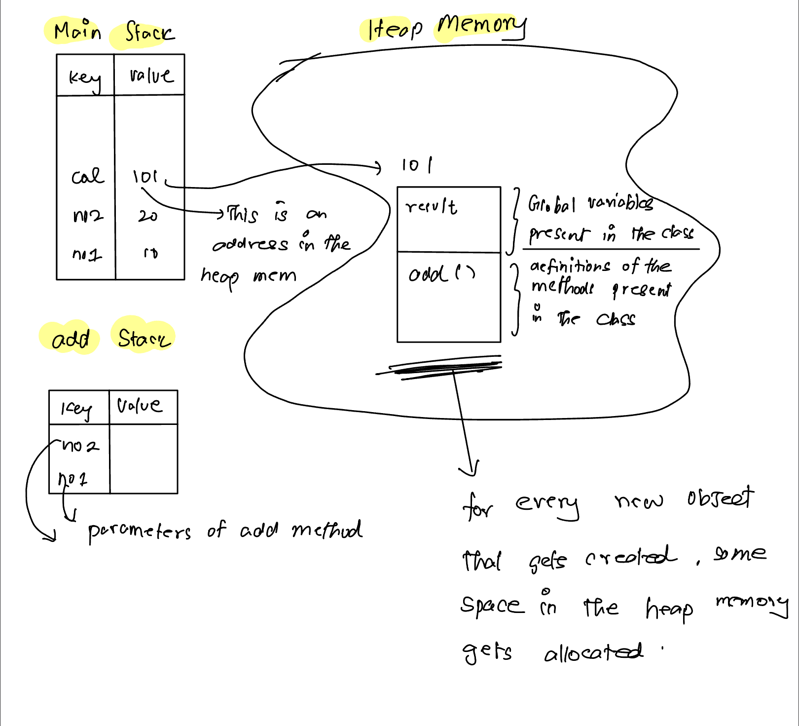

# Les1 
Java is platform independent(WORA) because of **JVM** which is inside **JRE**.Java uses camelCases.    
JVM(Java Virtual Machine) understands only **byte code**. So **javac** is needed to compile the java code(extension => .java) to byte code(extension => .class).  
JVM will **start executing** from the **main method** present in the file which we have specified => public static void main(String a[])  
Java is object oriented and strongly typed language.  
JRE => Java Runtime Environment. JRE = JVM + other libraries    

## Primitive data types
1. integer => byte(1 bytes) short(2 bytes) int(4 bytes) long(8 bytes)
2. float =>  double, float
3. character
4. boolean
By default double will be selected not float. So ```float amount1 = 2.3f;``` f is important else java will throw error.  
For long numbers use "l" at the last 
For char use ' and not "

## Type conversion
1. When byte is assigned to an integer variable it will be accepted but vice versa will not be accepted.
2. Explicit conversion is called as **Casting**. Eg: b = (byte)a;  
  
## Naming convention  
class and interface - Calc, Runnable  
variables and methods - marksCalculate, show()  
constants - AGE, NAME


# Les 2 Objects, Anonymous objects, Method overloading
In java objects are created using the JVM with the classes as blueprints for objects.  

JVM takes the byte code and executes. All the libraries that we have used resides in the JRE. Developers have JDK which comprises of JRE + JVM. In client machine we only need JRE + JVM no need JDK

public void func1() => Function that returns nothing
public String func1() => Function that returns string

**method overloading**
public int add(int no1, int no2)  
public int add(int no1, int no2, int no3)  
public double add(double no1, double no2)  
  
But the below examples **doesn't work**  
public int add(int no1, int no2)  
public double add(int no1, int no2)  

**Java working**  
For every method stack memory gets created.  
``` java
class Calculator{
    int result;
    public int add(int no1, int no2){
        result = no1 + no2;
        return result;
    }
}

class Les2 {
    public static void main(String a[]) {
        int no1 = 10;
        int no2 = 20;
        Calculator cal = new Calculator();
        System.out.println(cal.add(no1,no2));
    }
}
```
  

# Les 3 - Arrays


# Les 4 - Strings
String
Unlike primitive types which starts with smaller case(Eg int, float, double), String is a class so it starts with caps. 
So strings has to be created like this
```java
String name = new String("yesbee")
```
When java see code as mentioned below it automatically creates an object
```java
String name = "yesbee"
```

In heap memory there will be the **String constant pool** where all the strings will be stored.   
```java
String s1 = "sb";
String s2 = "sb";
System.out.println(s1 == s2);
//true
```
In the example mentioned above both s1 and s2 will be pointing to the same value in the String constant pool. Thats why s1 equals to s2.  

```java
String name = "yesbee";
name = "Hii " + name;
```
Initially name will be pointing to "yesbee" in the string constant pool. When name gets assigned with "Hii yesbee" a new entry is made in the string constant pool and name will be pointing to the new value. The old value will be cleared by the garbage collector.
Strings by default are immutable.  
Mutable strings can be created using **string buffer** or **string builder**  
String buffer is thread safe whereas string builder is not thread safe.  

# Les 5 - Static, constructor functions
**Static variables** are shared by all the objects. They should be **called** using their **class names**(Though they can be called using the object names avoid it) because they belong to the class and not to the object. Static variables can be used by non static methods.  
Constructor functions should have the same name as the class name and they never return anything. Constructor functions can be used for activities such as connection to DB.  
Just like method overloading, constructors can also be overloaded and a constructor with parameters is known as a parameterized constructor.  
**Constructor function**(inside a class) will be called **every time an object is created**. **Static blocks** will be **called only once** irrespective of the number of times objects are created from that class. The static blocks will be called even before the constructor. If no objects are created then then static block will not be called but we can initiate a class using the ``` Class.forName("Mobile")```(If a class is initiated then the static block will get executed)  
Just like static variables, static methods should be called using the class name.  
**A non static variable cannot be used inside a static metnod.**But the object itself can be passed to the static method and the non static variables can be accessed from the object.  

Why main method is static??  
Main function is the starting point of execution. But we cannot create an object of the class before main is executed. So we make main as static.  


# Les 6 - Encapsulation, Getters, Setters, this
Encapsulation is done using the private keyword. All instance variables(class level variables) keep them private(good practice).  
This keyword represents the current object.
```java
class Human{
    private String name;
    public void setName(String name){
        this.name = name;
    }
}
```
In the above example if name = name is used instead of this.name = name then the parameter "name" will be updated instead of the instance variable name


# Les 7 - this method, super method, inheritance
super class - parent class  
sub class - child class  

Every constructor has a super method in it even if we dont mention it(build in).  
The super method is used to call the constructor of the parent class(Inheritance).
If no arguments are passed then the parent(super) class's default constructor will be called if arguments are passed then the parameteriqed constructor will be called.  
**Every class** in java **extends the Object class** by default. 
The this method calls the default constructor of the same class. 


